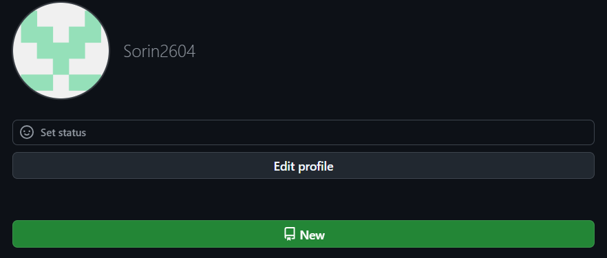

# Cont-Virt
## Informatii personale
<h3>Salut!</h3> Ma numessc Sorin, am 20 de ani si sunt student la Universiatea de stat din Moldova. 
<h3>Avatarul meu pe GitHub:</h3>   

<h3>Despre mine</h3>  
Sunt student la faculteatea de informatica. Sunt deja in anul doi de studii licenta . In general invat diefrite obiecte si ramuri de programare .
<h3>Domeniul de interes</h3>
Eu mai mult sunt atras de studierea partii BackEnd a oricarui site , sau aplicatie. De asmenea interesul meu se raspandeste si pe ramura de SoftDev (Software development)     

---

> Limbaje de programare
1. Care le cunosc: 
    - Java 
    - C
    - Python
    - JS
2. Care le invat in continuare:
    - SpringFramework
    - Php
    - SGBD
3. Care as dori sa le invat:
    - C#

--- 
> Date de contact
- Numar de telefon : 069033371
- E-mail: gortolomeisorinusm@gmai.com
